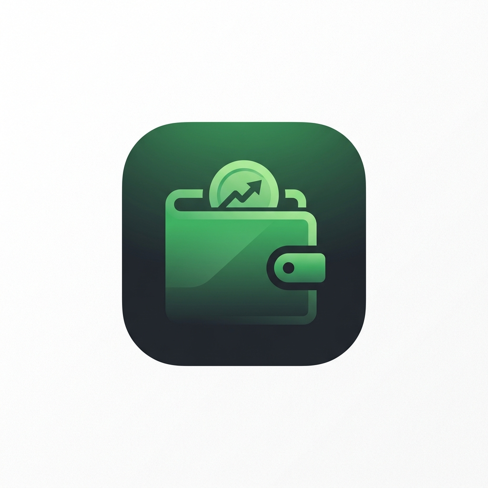

<p align="center">
  
</p>

<h1 align="center">Spendly</h1>

<p align="center">
  <strong>Your personal expense tracker — beautifully crafted with glassmorphism.</strong>
</p>

<p align="center">
  
  
  
  
</p>

---

## ✨ About

**Spendly** is a modern, feature-rich expense tracking app built with Flutter. It combines a stunning glassmorphic UI with powerful financial management tools to help you stay on top of your spending — all while looking gorgeous on every device.

## 🎨 Design Philosophy

Spendly embraces a **glassmorphism-first** design language:

- 🪟 Frosted glass cards, dialogs, and sheets
- 🌓 Full dark mode & light mode support with system theme detection
- ✨ Smooth micro-animations and transitions
- 💚 Semantic color coding — **green** for income, **red** for expenses
- 📱 Responsive layouts that adapt beautifully to any screen size

## 🚀 Features

### 💰 Transaction Management
- Add, edit, and delete income & expense transactions
- Categorize with custom categories and icons
- Add notes, dates, and timestamps to every entry
- Swipe-to-delete with undo support

### 📊 Analytics & Insights
- Interactive pie charts and bar graphs powered by **fl_chart**
- Monthly/weekly spending breakdowns
- Category-wise expense distribution
- Visual income vs. expense comparisons

### 🏠 Smart Dashboard
- At-a-glance financial summary (balance, income, expenses)
- Recent transactions feed
- Quick-action buttons for rapid entry

### 🔐 Authentication & Security
- Email/password signup & login
- Google Sign-In integration
- Forgot password with Firebase email reset
- Change password with old-password verification
- Set password for Google-auth users

### ⚙️ Settings & Personalization
- Profile management (name, photo upload)
- Theme selection (Light / Dark / System)
- Custom first day of month
- Category management (create, edit, reorder)
- Export data to **CSV / PDF**
- Logout with confirmation dialog

### 📦 Data & Export
- Local SQLite storage for offline-first experience
- Export transactions to CSV or PDF
- Share exported files directly from the app

## 🏗️ Architecture

Spendly follows a **clean architecture** pattern with feature-based organization:

```
lib/
├── app/                    # Router, theme, app config
│   ├── router/             # GoRouter setup & route definitions
│   └── theme/              # Color tokens, light/dark themes
├── core/                   # Shared utilities
│   ├── constants/          # App-wide constants
│   ├── database/           # SQLite database helper
│   ├── extensions/         # Dart extensions
│   └── helpers/            # Formatters, validators
├── data/                   # Data layer
│   ├── datasources/        # Local DB operations
│   ├── models/             # Data models
│   └── repositories/       # Repository implementations
├── domain/                 # Business logic
│   ├── entities/           # Core entities
│   └── services/           # Domain services
├── features/               # Feature modules
│   ├── analytics/          # Charts & insights
│   ├── auth/               # Login, signup, forgot password
│   ├── categories/         # Category management
│   ├── dashboard/          # Home screen
│   ├── settings/           # Profile & preferences
│   ├── splash/             # Animated splash screen
│   └── transactions/       # CRUD operations
└── shared/                 # Shared components
    ├── animations/         # Custom animations
    ├── providers/           # Global providers
    ├── widgets/            # Reusable UI (GlassCard, GlassDialog, etc.)
    └── utils/              # Shared utilities
```

## 🛠️ Tech Stack

| Layer | Technology |
|-------|-----------|
| **Framework** | Flutter 3.13+ |
| **Language** | Dart 3.13+ |
| **State Management** | Riverpod |
| **Navigation** | GoRouter |
| **Local Database** | SQLite (sqflite) |
| **Authentication** | Firebase Auth |
| **Cloud Storage** | Firebase Storage |
| **Charts** | fl_chart |
| **Animations** | Lottie |
| **Export** | CSV & PDF generation |

## 📋 Prerequisites

- Flutter SDK `^3.13.1`
- Dart SDK `^3.13.1`
- A Firebase project with Authentication & Storage enabled
- Android Studio / VS Code with Flutter extensions

## 🚀 Getting Started

### 1. Clone the repository

```bash
git clone https://github.com/sakib-codes/Spendly.git
cd Spendly
```

### 2. Install dependencies

```bash
flutter pub get
```

### 3. Configure Firebase

```bash
# Install FlutterFire CLI if you haven't
dart pub global activate flutterfire_cli

# Configure Firebase for your project
flutterfire configure
```

This will generate `lib/firebase_options.dart` and platform-specific config files.

### 4. Run the app

```bash
flutter run
```

## 🤝 Contributing

Contributions are welcome! Feel free to open issues and submit pull requests.

1. Fork the repository
2. Create your feature branch (`git checkout -b feature/amazing-feature`)
3. Commit your changes (`git commit -m 'feat: add amazing feature'`)
4. Push to the branch (`git push origin feature/amazing-feature`)
5. Open a Pull Request

## 📄 License

This project is licensed under the MIT License — see the [LICENSE](LICENSE) file for details.

## 👨‍💻 Author

**Sakib** — [@sakib-codes](https://github.com/sakib-codes) — [sakibcodes.com](https://sakibcodes.com)

---

<p align="center">
  Built with ❤️ and Flutter
</p>
